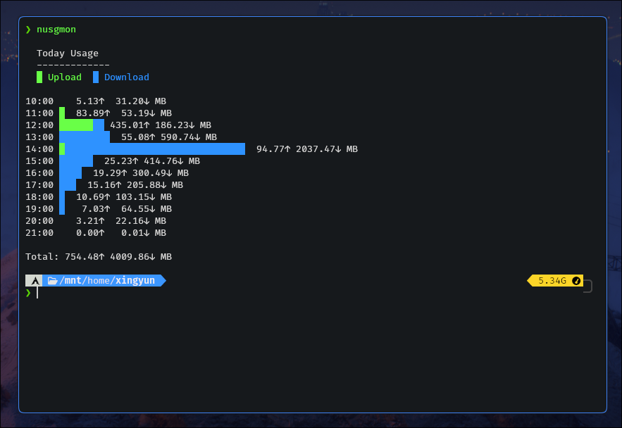

# Nusgmon - Network Usage Monitor
Lightweight Python CLI (command-line interface) network usage monitor for Linux.
Designed to run as a `systemd` service.

[](https://github.com/LUCKYS1NGHH/nusgmon)
[](https://github.com/LUCKYS1NGHH/nusgmon/stargazers)
[](https://www.gnu.org/licenses/gpl-3.0)
[](https://www.python.org/downloads/)



## Usage examples

Start recording network usage:

`nusgmon record`

Start recording network usage every second and of a specific interface only:

`nusgmon record -w 1 --iface wlp2s0`

View today's usage:

`nusgmon --today`

View current week's usage in JSON format:

`nusgmon --thisweek --json`

View usage after certain date:

`nusgmon --since 2026-03-15`

Prune records before 30 days:

`nusgmon db --prune 30`

## Features

- Record a specific interface data usage or of all as bundle

- Lightweight network usage monitor

- Stores usage history in SQLite

- Daily / weekly / monthly statistics

- Graph style options for statistics

- JSON output for scripting

- Works with systemd

- Configuration file support

- Sends data usage notification alerts (needs [nusgmon-alert](https://github.com/LUCKYS1NGHH/nusgmon-alert.sh))


## Dependencies
Requires Python 3 and psutil library.

```bash
pip install psutil # or install `python-psutil` system-wide through your package manager
```

## Installation

#### For Arch Linux (AUR)
```bash
yay -S nusgmon-git
```

#### For any other distro

The setup script installs the `nusgmon` program and performs the required
file copy, permission, PATH variable etc. setup.

```bash
git clone https://github.com/LUCKYS1NGHH/nusgmon.git
cd nusgmon
chmod +x setup.sh
sudo ./setup.sh
```

<details>
<summary> Uninstall </summary>

#### Arch Linux AUR
```bash
yay -R nusgmon-git
```

> Optional (removes the database):
> `rm -rf ~/.nusgmon`

#### Other Distro

```bash
sudo systemctl disable --now nusgmon
sudo rm /etc/systemd/system/nusgmon.service
sudo rm /usr/local/bin/nusgmon
sudo systemctl daemon-reload
```

</details>


## Wanna Contribute? 🤝

- Fork this repository to your own GitHub account.
- Create a branch for your changes:

```
git checkout -b feature/your-feature
```

- Write and test your changes (add tests if possible).
- Submit a pull request with a clear description of what you changed and why.


## Reporting issues
Please.. if you are facing any issue with nusgmon, please open a GitHub issue with details.


## Author
LUCKYS1NGHH
